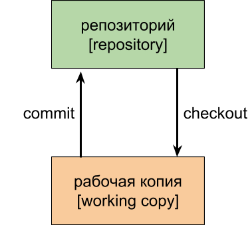
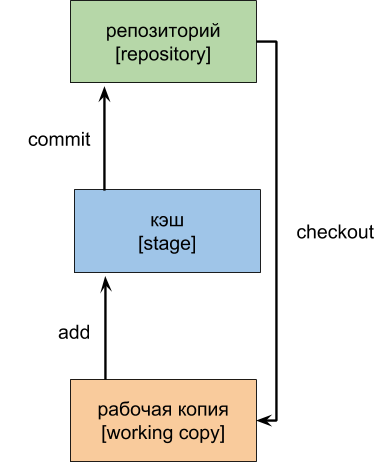

[< к содержанию](./readme.md)

## Архитектура

Система контроля версий *git* имеет архитектуру трех деревьев. Перед тем как перейти к ее описанию, для начала, рассмотрим архитектуру двух деревьев. Схематично она выглядит так, как представлено на рисунке ниже.
 
 

Для начал введем используемую в системах контроля версий терминологию. Набор файлов, с которым мы работаем в данный момент, называется рабочая копия (*working copy*). После того, как решено, что все нужные изменения на данный момент внесены, и об этом можно сообщить системе контроля версий, разработчик производит отправку изменений в репозиторий (*repository*). Репозиторий – это хранилище для нашего проекта, которое обслуживает система контроля версий. Сама операция отправки изменений называется commit, на русском языке ее так и называют – коммит. Если нам необходимо взять данные из репозитория, то мы осуществляем операцию *checkout*, которая на русском произносится как чекаут. Для названий операций commit и *checkout* не используют прямой перевод, предпочитают транскрипцию. В дальнейшем мы будем пользоваться как английским, так и русским эквивалентом терминов.
Для архитектуры двух деревьев регламент работы с репозиторием может выглядеть следующим образом:
1.	Перед началом работы разработчик делает *checkout*, для того чтобы быть уверенным, что он будет работать с актуальной рабочей копией.
2.	Разработчик вносит необходимые изменения в исходный код.
3.	Разработчик отправляет изменения в репозиторий (коммитит их).
4.	Повторить необходимое количество раз пункты 2 и 3.
Система контроля версий *git* использует архитектуру трех деревьев. Схематично она выглядит так как показано на рисунке ниже.

Суть ее заключается в том, что дополнительно добавляется ещё одно место, которое можно назвать кэшем или *stage* в английской терминологии. Рабочая копия и репозиторий идейно не отличается от их аналогов в архитектуре двух деревьев. Наличие дополнительного элемента меняет регламент работы, которой в этом случае выглядит так:
1.	Перед началом работы разработчик делает *checkout*, для того чтобы быть уверенным, что он будет работать с актуальной рабочей копией.
2.	Разработчик вносит необходимые изменения в исходный код.
3.	Разработчик отправляет необходимый набор файлов, изменения в которые внесены, в *stage*, для того, чтобы потом построить из них коммит. До того, как изменения будут отправлены в репозиторий, разработчик может добавлять и удалять файлы из *stage*. Набор файлов в stage, как правило, идеологически связан между собой.
4.	Разработчик отправляет изменения в репозиторий (коммитит их).
5.	Повторить необходимое количество раз пункты 2 – 4.

Наличие *stage* добавляет гибкости в процесс разработки, вы можете внести изменения в довольно большое количество файлов, но отправить их в репозиторий в разных коммитах со своими специфическими комментариями [[источник](https://devpractice.ru/git-for-beginners-part-4-git-arch/)].