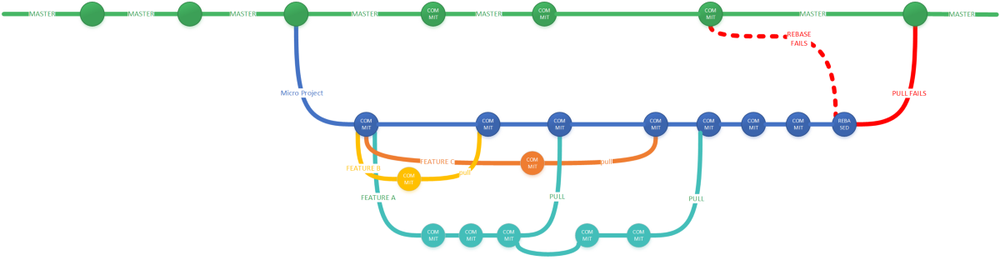
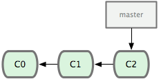
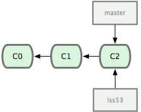
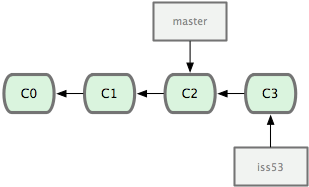
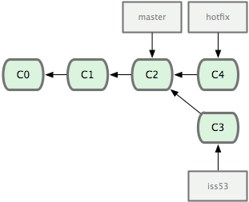
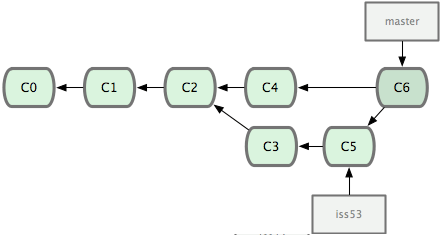

[< к содержанию](./readme.md)



## Ветвление

### Создание новой ветки
Есть разные принципы модели ветвления в *Git*. Одна из них: Новая задача - новая ветка. О другой поговорим далее.  
Создание новой ветки:  
`git checkout -b [новая_ветка]`  
Переключение между ветками  
Выбор ветки:  
`git checkout [репозиторий]/[ветка]`  
Удаление ветки:  
`git branch -d [ветка]`  
Обязательно нужно делать пуш изменений в общий репозиторий:  
`git push origin [ветка]`

### Запрос изменений с сервера
Чтобы обновить локальный репозиторий до последнего коммита, нужно сделать “пулл”:  
`git pull [ветка]` - например *origin master*  
Загрузить изменения с конкретной ветки:  
`git fetch <remote_name> <branch_name>`  

### Слияние веток
Чтобы слить ветку в ту, с которой вы сейчас работаете, используйте:  
`git merge [ветка]`  
Ветки можно сравнить:  
`git diff [одна_ветка] [другая_ветка]`  
Обновить локальный репозиторий до нового коммита:  
`git pull`  
Теги:  
`git tag [tag] [первые_десять_символов_соответствующего_коммита]`  
Историю репозитория — его лог:  
`git log`  

### Откат мерджа
Если проблема только в одном файле, то вот вам *"Ctrl Z"* для *HEAD’a*:  
`git checkout -- [имя_файла]`  
Но если проблема находится в локальном репозитории, то зачистите там все и верните версию с сервера:  
`git fetch origin git reset --hard origin/master`  

### Разрешение конфликтов при слиянии
Мы попытаемся слить две ветки под названием *1_branch* и *1_branch*.  
Где есть изменения в одних и тех же файлах. Если попытаться слить две ветки, они получат сообщение об ошибке:  
```bash
git merge 1_branch
Auto-merging print_array.js
CONFLICT (content): Merge conflict in print_array.js
Automatic merge failed; fix conflicts and then commit the result.
```  
Система не смогла разрешить конфликт автоматически, значит, это придется сделать разработчикам. Приложение отметило строки, содержащие конфликт:  
Над разделителем ======= мы видим последний (*HEAD*) "коммит", а под ним — конфликтующий. Таким образом, мы можем увидеть, чем они отличаются и решать, какая версия лучше. Или вовсе написать новую. В этой ситуации мы так и поступим, перепишем все, удалив разделители, и дадим *Git* понять, что закончили.Когда все готово, нужно закоммитить изменения, чтобы закончить процесс:  
```bash
git add -A
git commit -m "Array printing conflict resolved."
```
Пример:  


 
Короткая и простая история коммитов.

`git checkout -b iss53`



Создание новой ветки / указателя.

Сделали новый коммит:



Ветка *iss53* передвинулась вперёд во время работы.

Создание хот-фикса:  
```bash
git checkout master
git checkout -b hotfix
```


Ветка для решения срочной проблемы базируется на ветке *master*.  
Слияние веток:
```bash
git checkout master
git merge hotfix
git merge iss53
```


*Git* автоматически создаёт новый коммит, содержащий результаты слияния.

[< к содержанию](./readme.md)