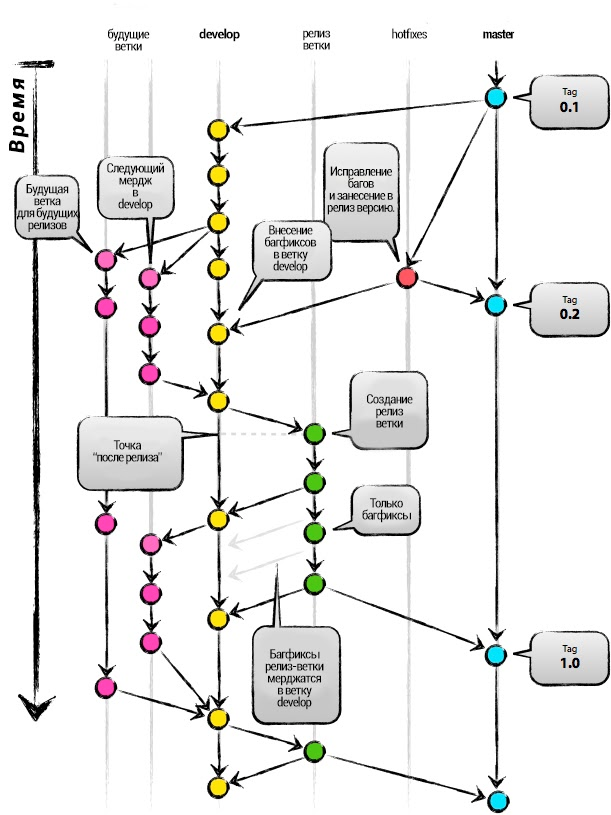

[< к содержанию](./readme.md)

## Удачная модель ветвления для Git



### Главные ветви
Ядро модели разработки не отличается от большинства существующих моделей. Центральный репозиторий содержит две главные ветки, существующие всё время.
* master -  создаётся при инициализации репозитория, считаем ветку origin/master главной.
* develop - ветвь origin/develop мы считаем главной ветвью для разработки.

### Вспомогательные ветви
* Ветви функциональностей (Feature branches)
* Ветви релизов (Release branches)
* Ветви исправлений (Hotfix branches)

Ветви функциональностей (feature branches) могут порождаться от: develop и должны вливаться в: develop Соглашение о наименовании: всё, за исключением master, develop, release-* или hotfix-*  
При начале работы над новой функциональностью делается ответвление от ветви разработки (develop).  
`git checkout -b myfeature develop`  

### Ветви релизов (release branches)
Могут порождаться от: develop  
Должны вливаться в: develop и master  
Соглашение о наименовании: release-*  
Ветвь релиза создаётся из ветви разработки (develop).

### Закрытие ветви релиза
Когда мы решаем, что ветвь релиза (release branch) окончательно готова для выпуска, нужно проделать несколько действий. В первую очередь ветвь релиза вливается в главную ветвь (напоминаю, каждый коммит в master — это по определению новый релиз). Далее, этот коммит в master должен быть помечен тегом, чтобы в дальнейшем можно было легко обратиться к любой существовавшей версии продукта. И наконец, изменения, сделанные в ветви релиза (release branch), должны быть добавлены обратно в разработку (ветвь develop), чтобы будущие релизы также содержали внесённые исправления багов.  
```bash
git checkout master

Switched to branch 'master'
git merge --no-ff release-1.2
Merge made by recursive.
(Отчёт об изменениях)

git tag -a 1.2
```
Теперь релиз издан и помечен тегом.   
Чтобы сохранить изменения и в последующих релизах, мы должны влить эти изменения обратно в разработку. Делаем это так:
```bash

git checkout develop

Switched to branch 'develop'

git merge --no-ff release-1.2

Merge made by recursive.
(Отчёт об изменениях)
```
Этот шаг, в принципе, может привести к конфликту слияния (нередко бывает, что к причиной конфликта является изменение номера версии проекта). Если это произошло, исправьте их и издайте коммит.  
Теперь мы окончательно разделались с веткой релиза. Можно её удалять, потому что она нам больше не понадобится:
```bash
git branch -d release-1.2

Deleted branch release-1.2 (was ff452fe).
```
### Ветви исправлений (hotfix branches)
Могут порождаться от: master  
Должны вливаться в: develop и master  
Соглашение о наименовании: hotfix-*  
Ветви исправлений (hotfix branches) создаются из главной (master) ветви.

[< к содержанию](./readme.md)
