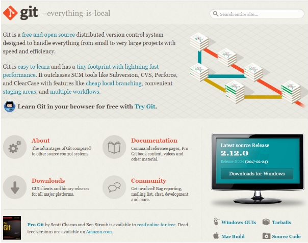
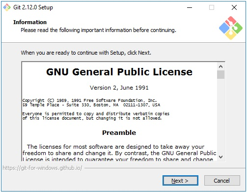
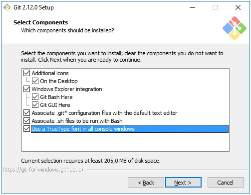
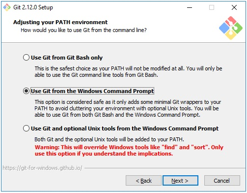
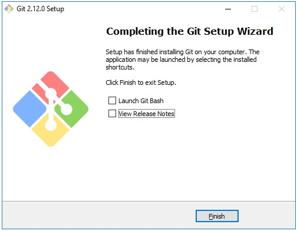

[< к содержанию](./readme.md)

## Установка

Для установки *Git* под *Windows* необходимо предварительно скачать дистрибутив. Для этого перейдите на страницу https://git-scm.com/
Если вы зашли из под операционной системы (ОС) Windows, главная страница сайта будет выглядеть примерно так, как показано на рисунке ниже. Для других ОС отличие будет заключаться в том, что изменится область для скачивания дистрибутива (см. правый нижний угол).   
    
Для того чтобы скачать *Git* нужно нажать на кнопку Downloads for *Windows*, расположенную в правой части окна.
Процесс дальнейшей установки *Git* выглядит так:
1. Запустить установочный файл
2. Ознакомиться, если есть желание, с лицензионным соглашением и нажать на кнопку *Next*   
   
3. Выбрать компоненты, которые следует установить   
   
4. Указать способ использования *Git*   
   
В этом окне доступны три возможных варианта:
* *Use Git from Git Bash only*  
Переменная *PATH* не модифицируется и работа с *Git* возможна только через специализированную оболочку, которая называется *Git Bash*.
*	*Use Git from the Windows Command Prompt*  
В этом случае происходит минимальная модификация переменной окружения *PATH*, которая позволит работать с *Git* через командную стоку *Windows*. Работа через *Git Bash* также возможна.
*	*Use Git and optional Unix tools from the Windows Command Prompt*  
В переменную *PATH* вносится значительное количество модификаций, которые позволят, в рамках командной строки *Windows*, использовать как *Git* так и утилиты *Unix*, которые поставляются вместе с дистрибутивом *Git*.

Мы выберем опцию *Use Git from the Windows Command Prompt*.  
5. Настроить правила окончания строки   
Существует два варианта формирования конца строки в текстовых файлах – это *Windows* стиль и *Unix* стиль. Данное окно позволяет выбрать одну из опций, определяющих правило формирования окончания строки:
* *Checkout Windows-style, commit Unix-style line endings*  
*Checkout* (операция извлечения документа из хранилища и создания рабочей копии) производится в *Windows* стиле, а *commit* (операция отправки изменений в репозиторий) в *Unix* стиле.  
* *Checkout as-is, commit Unix-style line endigns*  
*Checkout* производится в том формате, в котором данные хранятся в репозитории, а *commit* осуществляется в *Unix* стиле.  
* *Checkout as-is, commit as-is*  
*Checkout* и *commit* производятся без дополительных преобразований.

Мы выберем опцию *Checkout Windows-style, commit Unix-style line endings*.  
6. Выбрать эмулятор терминала, который будет использован с *Git Bash*  
Возможен выбор из двух вариантов:
* *Use MinTTY (the defaul terminal of MSYS2)*  
*Git Bash* будет использовать в качестве эмулятора терминала *MinTTY*.
* *Use Windows’ default console window*  
*Git* будет использовать *Windows* консоль (“*cmd.exe*”).

Мы выберем опцию *Use MinTTY (the defaul terminal of MSYS2)*.  
7. Настроить дополнительные параметры  
Доступны следующие параметры:
* *Enable file system caching*  
Включение операции кэширования при работе с файлами. Эта опция позволит значительно повысить производительность.
* *Enable Git Credential Manager*  
Предоставляет возможность работы с защищенным хранилищем.
* *Enable symbolic links*  
Активирует работу с символьными ссылками.
Мы выберем опцию *Enable file system caching* и *Enable Git Credential Manager*.
8. Завершение установки

После нажатия на кнопку *Install* будет произведена установка *Git* на *Windows*, по окончании установки пользователь получит соответствующее сообщение [источник](https://devpractice.ru/git-for-beginners-part-2-install-git/)].   

[< к содержанию](./readme.md)